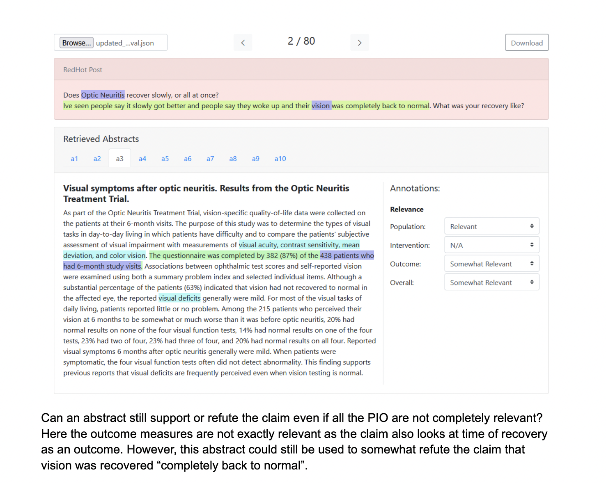

Third week!
As an update, I reformatted the data into a compatible json to view with Sebastian's viewer. :)
After reaching out and talking to Somin, who was very helpful, he suggested to use a more SOTA mebedding model, thus we decided to continue with my Alibaba model approach. I am happy I don't have to embed a dataset of 800,000 abstracts again.
From the annotation and seeing the abstracts so far, it seems that compared to the DPR Roberta baseline method, the Alibaba retriever is retrieving much more relevant abstracts that are helpful to answering and checking the claim, which is good.

Now moving onto the annotation, Sebastian and I Zoomed to discuss and annotate a claim with the 10 retrieved abstracts together. From that one document, we saw many nuances in the annotation, and are editing and raising questions in the annotation guideline as we go. One example of nuance we saw is that many times the claim isn't very clear, or is more of an open question rather than a positioned argument. As a potential solution, we suggested adding a label to annotation between supports/refutes, which is conditionally supports.

Furthermore, we're still debating how to systematically aggregate the relevance rankings of all 10 abstracts and synthesize them into an overall claim checking explanation. We think that we should give overall guidelines otherwise aggregating the 10 pieces of medical evidence into a final explanation could be handwavy and difficult.

There are still many questions we are exploring and additional samples that we should annotate. 

An image of how this looks like:

To more annotation and thinking about valuable metrics/annotation guidelines 🥂🥂
